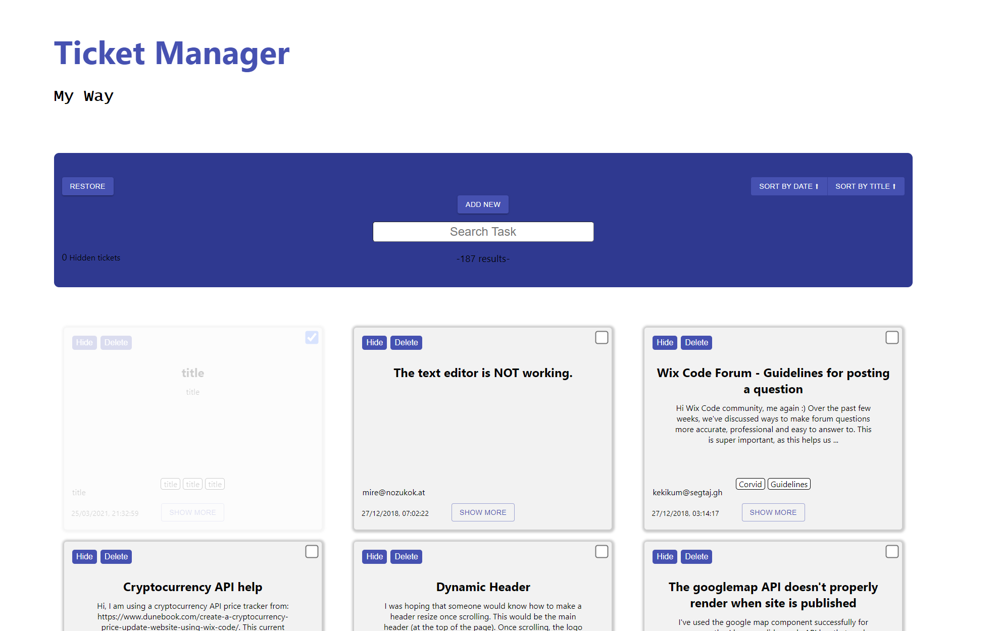

# 
 Ticket Manager

### Heroku link
https://gentle-cliffs-58587.herokuapp.com/

## Overview
This is a Ticket Manager system build my way.

## Main Features

1. The user can search for a ticket title. The view will change and only the tickets with contained input string will be presented.
2. The user can press the hide button on each ticket to hide it.
3. The user has a live count of how many tickets are hidden.
4. The user can press the restore button to make the hidden tickets reappear.
5. Added animation when hovering over the tickets and when checking them.

## Bonus Features

1. The user can add a new ticket with a title content user email and labels.
2. The user can delete a specific ticket.
3. If the content is to long it wont show it all (above 200 characters).
4. The user can check the checkbox to mark the ticket as done/uncheck for undone.
5. The user can sort the tasks by date or by name both ascending and descending.
6. Added a spinner at the start when loading all the tickets.
7. If a user successfully added a new ticket an alert will appear saying adding was ok.
8. If the user is offline and tries to type in the search he will be prompted with an alert.
7. If a ticket add was not successful the user is prompted with error alert.

## Server Side Bonus

1. Added a POST route to add a new ticket to the data base.
2. Added a DELETE route to delete a specific ticket using its ticket ID.

## Testing Bonus

1. Added a test for the POST route.
2. Added a test for the DELETE route.
